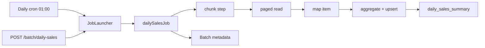
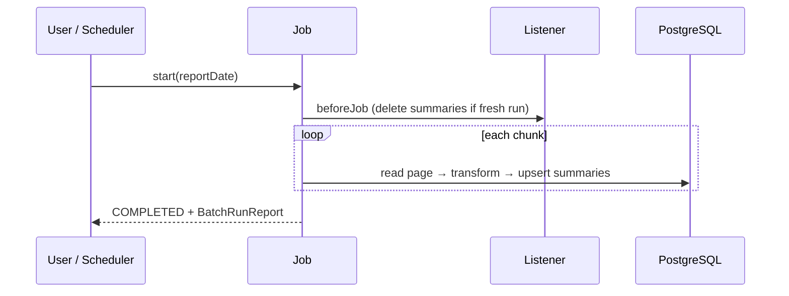
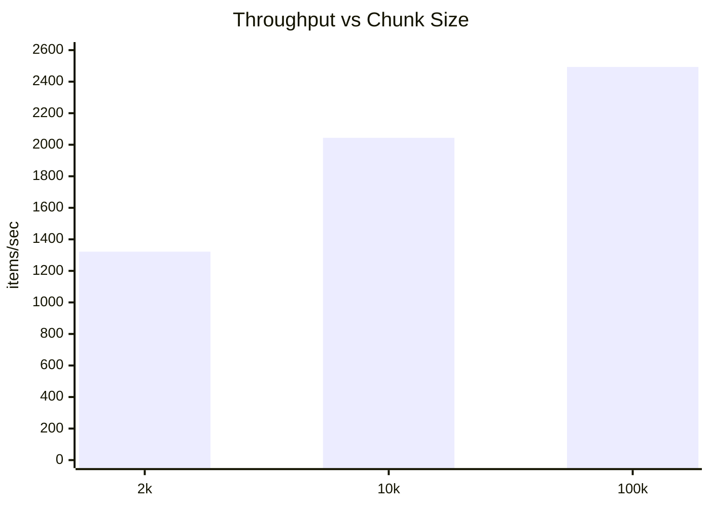

# Parallel Programming Report

**Parallel Ecommerce Ecosystem** — Spring Boot 3.4 · Java 17 · PostgreSQL · Docker

| NFR | Topic |
|-----|--------|
| #1 | Optimistic Locking (`@Version`) |
| #2 | Resource management (HikariCP) |
| #3 | Asynchronous queue processing (`@Async` + events) |
| #4 | Daily sales **Batch Processing** (Spring Batch) |
| #5 | High availability & load distribution (Apache) |

---

## Quick start

### Run & open the guide page

**Load balancer (2 apps + Apache)** — recommended for NFR #5 demo:

```bash
docker compose up --build -d
```

| URL | Purpose |
|-----|---------|
| http://localhost:9999/ | **Landing page** — links to balancer, batch, API |
| http://localhost:9999/balancer-manager | Apache balancer manager (enable/disable `app1` / `app2`) |
| http://localhost:9999/server-status | Apache server status |
| http://localhost:9999/batch/job-history | Spring Batch job history |

**Single app (batch / dev on port 8080):**

```bash
docker compose -f docker-compose.dev.yml up --build -d
# http://localhost:8080/
```

**Tests (no Docker):**

```bash
mvn test -Dtest=DailySalesBatchJobTest
mvn test -Dtest=OrderServiceConcurrencyTests
mvn test -Dtest=DailySalesBatchBenchmarkTest -Dheavy=true   # ~5+ min
```

> **Note:** Root `/` returns 404 only if the app image was built **before** `static/index.html` was added. Rebuild: `docker compose build app1 app2 && docker compose up -d`.

---

# NFR #1 — Optimistic Locking

## معلومات سريعة

### 1) المشكلة (Concurrent Access)

عند محاولة عدة طلبات متزامنة تعديل نفس السجل (مثل `Product.stock_quantity`) قد يحدث:

- **Lost Update:** آخر عملية حفظ تطغى على عمليات أخرى بدون اكتشاف التعارض.
- **Overselling:** قبول عدد checkouts أكبر من المخزون الحقيقي.

الهدف: ضمان أن المخزون لا ينخفض عن الصفر وأن عدد الطلبات الناجحة يساوي المخزون المتاح.

### 2) البدائل المتاحة (ملخص قرار)

| # | الطريقة | الفكرة باختصار | ملاحظة للمشروع |
|---|---------|----------------|----------------|
| 1 | بدون تزامن | `findById` ثم تحديث مباشر | ❌ يؤدي إلى overselling |
| 2 | **Pessimistic Lock** | قفل الصف حتى نهاية الـ transaction | ✅ مستخدم حالياً في checkout |
| 3 | **`@Version` (Integer/Long)** | شرط `WHERE version = ?` عند التحديث | ✅ الخيار المعتمد تصميمياً |
| 4 | `OptimisticLockType.ALL` | مقارنة كل الأعمدة في WHERE | أبطأ، مناسب أكثر لـ legacy |
| 5 | `OptimisticLockType.DIRTY` | مقارنة الحقول المتغيرة فقط | أقل وضوحاً من version |
| 6 | `@Version` + Timestamp | نسخة زمنية بدلاً من رقم | أقل دقة من Integer |
| 7 | Serializable isolation | رفع مستوى العزل في SQL | أداء منخفض |
| 8 | SQL ذري | `SET stock = stock - 1 WHERE stock >= 1` | فعّال للمخزون فقط |
| 9 | قفل تطبيقي / Redis | `synchronized` أو Redis lock | غير مستخدم حالياً |

### 3) كيف يعمل `@Version` (Optimistic Locking)

الفكرة: عند الحفظ، يتأكد JPA/Hibernate أن السجل لم يتغير منذ قراءته.

```sql
UPDATE products
SET stock_quantity = ?, version = version + 1
WHERE id = ? AND version = 3;
```

```java
@Version
private Integer version; // في Product.java
```

**عند التعارض:** إذا حدّث طرف آخر نفس الصف قبل الحفظ، شرط `WHERE ... AND version = ?` لا يطابق أي صف → `OptimisticLockException` / `StaleObjectStateException` (أو `ObjectOptimisticLockingFailureException` في Spring).

### 4) لماذا اخترنا `@Version Integer`؟

- أداء أفضل وبساطة: شرط واحد في WHERE بدلاً من مقارنة كل الأعمدة (ALL/DIRTY).
- دقة أعلى من Timestamp.
- سهل تحويله إلى Retry محدود أو HTTP **409 Conflict**.
- Schema جديد: إضافة عمود `version` مباشرة.

> **شفافية التنفيذ الحالي:** checkout ينجح لأن هناك **Pessimistic Lock** داخل مسار checkout. `@Version` جاهز؛ الانتقال الكامل لـ Optimistic يحتاج retry ومعالجة الاستثناء في `ApiExceptionHandler`.

### 5) نتائج الاختبار (قبل/بعد)

**الملف:** `OrderServiceConcurrencyTests.java`

| البند | القيمة |
|-------|--------|
| المنتج | stock = 10 |
| الخيوط | 50 (quantity=1 لكل سلة) |
| الآلية | `ExecutorService` + `CountDownLatch` |
| المتوقع | 10 checkouts، 10 طلبات، stock = 0 |

```bash
mvn test -Dtest=OrderServiceConcurrencyTests
```

(اختبار H2 في الذاكرة — لا يحتاج Docker)

#### (أ) قبل: `findById` + `@Version` بدون Pessimistic

```
ObjectOptimisticLockingFailureException:
Row was updated or deleted by another transaction
```

`@Version` منع التحديث الصامت المتضارب، لكن بدون retry يفشل الاختبار.

#### (ب) قبل: `findById` بدون `@Version`

```
expected: 10L but was: 50L  → Overselling
```

#### (ج) بعد: الكود الحالي (Pessimistic + `@Version`)

```
Tests run: 1, Failures: 0, Errors: 0 — BUILD SUCCESS
```

#### مقارنة نهائية

| المؤشر | بدون حماية | `@Version` فقط | بعد (Pessimistic + `@Version`) |
|--------|------------|----------------|--------------------------------|
| نجاح checkout | 50 | فشل باستثناء | **10** |
| عدد الطلبات | > 10 | — | **10** |
| المخزون النهائي | خاطئ | — | **0** |
| Maven | FAILURE | FAILURE | **SUCCESS** |

**قبل الحماية:** 50 خيط يقرأ stock=10 → كتابة دون تنسيق → 50 طلب (overselling).

**بعد الحماية:** Pessimistic lock → طلبات متسلسلة على الصف → 10 طلبات فقط، stock=0.

### 6) الخلاصة

`@Version` (Integer) هو خيار Optimistic المعتمد تصميمياً. النجاح الحالي يعتمد على **Pessimistic Lock** في checkout. للانتقال الكامل لـ Optimistic: retry policy + معالجة `OptimisticLockException` (مثلاً HTTP 409).

### 7) الملفات ذات العلاقة

| الملف | الدور |
|-------|------|
| `Entity/Product.java` | `@Version` |
| `repository/ProductRepository.java` | `findByIdWithPessimisticLock` |
| `service/OrderService.java` | checkout |
| `OrderServiceConcurrencyTests.java` | اختبار التزامن |

---

# NFR #2 — Resource Management (HikariCP)

## تعديل إعدادات HikariCP

**(Default)** Spring Boot يدير الـ connection pool افتراضياً (حد أقصى ~10 اتصالات).

تم تجربة ضبط `spring.datasource.hikari.maximum-pool-size` (مثلاً 5 vs 15) ومراقبة الأداء تحت الحمل.

| الإعداد | الملاحظة |
|---------|----------|
| pool صغير (≈5) | ضغط أعلى، تأخير أكبر عند ذروة الطلبات |
| pool أكبر (≈15) | تحسن عدد الـ requests وتقليل التأخير |

> أضف لقطات الشاشة (JMeter / metrics) في مجلد `docs/images/` إن وُجدت في تقريرك.

**الإعداد الحالي في `application.properties`:**

```properties
spring.datasource.hikari.maximum-pool-size=20
```

---

# NFR #3 — Asynchronous Queue Processing

## 1) المشكلة

عند **checkout**، عمليات ثانوية (فاتورة، بريد، audit) داخل الـ request thread ترفع **response time** وتخفض **throughput**.

الهدف: نقل المهام غير الحرجة إلى **background processing** غير متزامن.

## 2) الحلول المقترحة

| الطريقة | الفكرة | ملاحظة |
|---------|--------|--------|
| Synchronous | كل شيء في request thread | ❌ بطيء |
| `new Thread()` | thread لكل مهمة | ❌ خطر thread explosion |
| `ExecutorService` يدوي | تحكم يدوي | أعقد |
| `@Async` فقط | Spring async | يحتاج resource control |
| RabbitMQ / Kafka | message broker | أعقد من المطلوب |
| **`@Async` + `ThreadPoolTaskExecutor` + Events** | **Hybrid** | ✅ المعتمد |

## 3) الحل المعتمد (Hybrid)

- `@Async`
- `ThreadPoolTaskExecutor` (`config/AsyncConfig.java`)
- **Event Driven:** `OrderCreatedEvent` → `OrderCreatedListener`
- معالجة داخلية شبيهة بالـ queue عبر thread pool

## 4) لماذا لم نستخدم RabbitMQ/Kafka؟

- تطبيق **single JVM**؛ لا distributed deployment فعلي في المشروع.
- الهدف: مفاهيم **Parallel Programming** وليس بنية message broker كاملة.
- التصميم يسمح بالترقية لاحقاً بفضل الـ events.

## 5) Reliability و Thread Safety

**`@TransactionalEventListener(phase = AFTER_COMMIT)`** — المهام الخلفية بعد commit الطلب فقط.

**Thread pool (مثال):**

| الخاصية | القيمة |
|---------|--------|
| corePoolSize | 4 |
| maxPoolSize | 8 |
| queueCapacity | 100 |

## 6) فشل background task

فشل المهمة الثانوية **لا يلغي** checkout؛ الطلب محفوظ؛ الخطأ يُسجّل في الـ logs.

## 7) نتائج الاختبار

| العملية | الزمن |
|---------|-------|
| Checkout response (مع async خلفي) | ~212 ms |

**Logs:** `ASYNC TASK STARTED` على `Async-Executor-*` — يؤكد تنفيذاً خارج الـ main request thread.

## 8) الخلاصة

تحسين زمن الاستجابة مع إبقاء العمليات الثانوية في الخلفية؛ بنية قابلة للترقية إلى broker لاحقاً.

### ملفات ذات العلاقة

| الملف | الدور |
|-------|------|
| `config/AsyncConfig.java` | thread pool |
| `event/OrderCreatedEvent.java` | event |
| `listener/OrderCreatedListener.java` | `@Async` handler |
| `service/OrderService.java` | نشر الحدث بعد checkout |

---

# NFR #4 — Daily Sales Batch Processing (Spring Batch)

## نظرة هندسية

**Spring Batch** يقرأ **COMPLETED** order items ليوم محدد ويبني جدول `daily_sales_summary` (صف لكل **product**):

- إجمالي الكمية
- إجمالي الإيراد (`unit price at purchase`)
- عدد الطلبات المميزة

## لماذا Spring Batch؟

| Criteria | Naive service | `parallelStream` | **Spring Batch** |
|----------|---------------|------------------|------------------|
| Chunk processing | ❌ | ⚠️ | ✅ |
| Restart after failure | ❌ | ❌ | ✅ |
| Metadata logging | ❌ | ❌ | ✅ |
| Fault tolerance | ⚠️ | ⚠️ | ✅ |
| Transaction boundaries | ❌ | ❌ | ✅ |
| Memory-safe paging | ⚠️ | ⚠️ | ✅ |

يرتبط بـ Session 4: **partitioning** (chunks)، **ETL**, **throughput**, **fault tolerance**, **restart**.

## معمارية



## دورة التنفيذ



## قرارات هندسية

### لماذا لم نفعّل multithreading؟

الـ **bottleneck** كان **DB I/O** و**transaction commits**، وليس CPU. تحسين **chunk size** رفع **throughput** ~1.9× بدون threads إضافية.

### Idempotency

- **Fresh run:** حذف summaries ذلك اليوم ثم إعادة البناء من order items.
- **Restart:** لا حذف؛ يكمل من آخر chunk ناجح (metadata).

### Fault tolerance

سجل بلا **product** → **skip** (حتى `skipLimit=100`).

## Benchmark (500,000 rows, H2)

```bash
mvn test -Dtest=DailySalesBatchBenchmarkTest -Dheavy=true
```

| Chunk size | Job time | Throughput |
|------------|----------|------------|
| 2,000 | 6m 18s | 1,322 items/sec |
| 10,000 | 4m 04s | 2,044 items/sec |
| 100,000 | 3m 20s | 2,493 items/sec |



## REST API

| Method | Endpoint | الوظيفة |
|--------|----------|---------|
| POST | `/batch/daily-sales?date=YYYY-MM-DD` | تشغيل الـ Job (sync) |
| GET | `/batch/daily-sales/summary?date=...` | قراءة الملخص |
| GET | `/batch/job-history` | تاريخ التشغيلات |

عبر load balancer: استبدل المنفذ بـ **9999** (مثلاً `http://localhost:9999/batch/job-history`).

## الاختبارات

```bash
mvn test -Dtest=DailySalesBatchJobTest          # correctness + idempotency
mvn test -Dtest=DailySalesBatchBenchmarkTest -Dheavy=true
```

## ملفات ذات العلاقة

| الملف | الدور |
|-------|------|
| `batch/DailySalesBatchJobConfig.java` | Job / Step / chunk |
| `batch/SalesOrderItemProcessor.java` | transform |
| `batch/SalesSummaryWriter.java` | load |
| `controller/BatchController.java` | REST |
| `batch/DailySalesBatchJobListener.java` | idempotency delete |

تفاصيل إضافية: راجع أيضاً `PROJECT_REPORT_AR.md` إن وُجد.

---

# NFR #5 — High Availability & Load Distribution

## الهدف

توزيع الأحمال على أكثر من نسخة تطبيق لضمان **High Availability**: إذا توقفت نسخة، يستمر الخدمة عبر الأخرى، مع تقسيم **traffic** بين السيرفرات.

## Stack

| المكوّن | التقنية |
|---------|---------|
| Load balancer | **Apache HTTP Server** |
| Algorithm | **Round Robin** (`lbmethod=byrequests`) |
| Apps | `app1`, `app2` (Spring Boot على 8081 داخل الشبكة) |
| Public port | **9999** → Apache → cluster |

## لماذا Apache؟

بدائل أسرع (Nginx, HAProxy, Traefik…) موجودة، لكن Apache يوفّر:

1. **Balancer manager** — واجهة تفاعلية (`/balancer-manager`) لإدارة الأعضاء في **runtime**.
2. **صلاحيات تحكم** — تعطيل/تفعيل `app1` أو `app2` أثناء التشغيل (ليس read-only فقط).

## التشغيل

```bash
docker compose up --build -d
```

| الرابط | الوصف |
|--------|--------|
| http://localhost:9999/ | صفحة الدليل (HTML) |
| http://localhost:9999/balancer-manager | لوحة التحكم |
| http://localhost:9999/api/products | مثال API عبر الموازن |

## تجربة تعطيل عضو (demo)

1. افتح **balancer-manager**.
2. عطّل **app1** (`Disable` → Submit).
3. أرسل عدة requests — يجب أن تذهب كلها إلى **app2** (ارتفاع عداد `app2`، بقاء `app1` ثابتاً أو `Disabled`).

> أضف لقطات Apache Dashboard من تجربتك في `docs/images/` إن لزم التقرير المصوّر.

## الملفات

| الملف | الدور |
|-------|------|
| `docker-compose.yml` | `app1`, `app2`, `apache-lb`, `db` |
| `httpd.conf` | Round Robin + proxy rules |

---

## Project structure (merged repo)

```
Parallel-Programming/
├── src/                    # Spring Boot application (canonical)
├── pom.xml
├── docker-compose.yml      # LB: port 9999
├── docker-compose.dev.yml  # Single app: port 8080
├── httpd.conf
├── postman_collection.json
├── PROJECT_REPORT_AR.md
└── README.MD               # this file
```

---

## Related docs

- **Landing page (when app is running):** http://localhost:9999/ or http://localhost:8080/
- **Arabic project report:** `PROJECT_REPORT_AR.md`
- **Postman:** `postman_collection.json`
